.. _instructie_win_gui:

**************************
Instructie (Windows - GUI)
**************************

Deze beschrijving is een voorbeeldinstructie om de benodigde software te installeren en daarbij tevens een database dump terug te zetten (te restoren).
Het voorbeeld hier beschreven is voor de BAG PostGIS download, maar zal hetzelfde zijn voor andere NLExtract downloads, zoals de BGT en de BRK.
Met dank aan Geert Doornbos voor opstellen van deze instructie.

We beschrijven de volgende stappen:

* :ref:`Database Dump Downloaden <dump-downloaden>`
* :ref:`PostgreSQL Installeren <postgresql-install>`
* :ref:`PostGIS Installeren <postgis-install>`
* :ref:`PgAdmin III - BAG login toevoegen <bag-create-login>`
* :ref:`PgAdmin III - BAG database aanmaken <bag-create-database>`
* :ref:`PgAdmin III - BAG dump terugzetten <bag-dump-restore>`

|
|

.. _dump-downloaden:

Database Dump Downloaden
~~~~~~~~~~~~~~~~~~~~~~~~

Maak een nieuwe map met bijvoorbeeld de naam 'NLExtract'. Dit is gewoon een locatie om de dumps die gedownload worden te bewaren.

.. image:: _static/images/nlextractimg(1).png
    :alt: lege map aanmaken

Ga naar de pagina (zoals beschreven in :ref:`NLExtract Download Service <nlextract-downloads>`) waar de gewenste database dump gekozen kan worden. In deze instructie kiezen we de BAG database. 
    
.. image:: _static/images/nlextractimg(2).png
    :alt: dump downloaden

Kies 'link opslaan als' op 'bag-laatst.backup' via het contextmenu (rechter muisknop) en plaats het bestand in de zojuist gemaakte map 'NLExtract'.
Afhankelijk van de netwerkverbinding kan dit even duren, want het bestand is groter dan 2 GB.

.. image:: _static/images/nlextractimg(4).png
    :alt: dump gedownload

Je kunt eventueel bag-amstelveen.backup downloaden om te testen met een kleiner bestand. 

|
|

.. _postgresql-install:

PostgreSQL Installeren
~~~~~~~~~~~~~~~~~~~~~~

Ga naar de `PostgreSQL website <https://www.postgresql.org/download/windows/>`_ en klik door naar de `download <http://www.enterprisedb.com/products-services-training/pgdownload#windows>`_ pagina van EnterpriseDB.
We kiezen hier het installatieprogramma (32 of 64 bit - zie <Win>+<Break>) voor de meest recente en stabiele versie, in dit geval 9.5.3. 
    
.. image:: _static/images/nlextractimg(3).png
    :alt: PostgreSQL downloaden

Voer het gedownloade bestand uit en de installatie begint.

.. image:: _static/images/nlextractimg(5).png
    :alt: start installatie postgresql

Er wordt gevraagd waar het programma geïnstalleerd moet worden.
    
.. image:: _static/images/nlextractimg(6).png
    :alt: program files

Daarna wordt gevraagd welke map gekozen kan worden voor data (databases). Er wordt voorgesteld om een data map in de 'Program Files' map
te gebruiken voor opslag van data. Dat is ongebruikelijk; beter is het om data van programmabestanden te scheiden. We kiezen
een eigen map.
    
.. image:: _static/images/nlextractimg(7).png
    :alt: data files
    
Kies een wachtwoord voor de hoofdgebruiker 'postgres' en onthoud deze. De gebruikersnaam 'postgres' en het wachtwoord vormen de combinatie om op een later tijdstip toegang tot PostgreSQL te krijgen.

.. image:: _static/images/nlextractimg(8).png
    :alt: hoofdgebruiker password

Behoud het standaard poortnummer.

.. image:: _static/images/nlextractimg(9).png
    :alt: standard port number
    
De 'Default locale' is prima.

.. image:: _static/images/nlextractimg(10).png
    :alt: default locale

Alles is gereed om de installatie te beginnen.
    
.. image:: _static/images/nlextractimg(11).png
    :alt: start install

Als het goed is, zal de installatie vlot verlopen. 
    
.. image:: _static/images/nlextractimg(12).png
    :alt: fast install
    
Nu is PostgreSQL geïnstalleerd. Het laatste scherm biedt de mogelijkheid om uitbreidingen toe te voegen. We laten het vinkje voor de Stack Builder aan staan, zodat we PostGIS kunnen installeren. Dit wordt hierna beschreven.

.. image:: _static/images/nlextractimg(13).png
    :alt: extensions

|
|

.. _postgis-install:

PostGIS Installeren
~~~~~~~~~~~~~~~~~~~

PostGIS is de uitbreiding op PostgreSQL die het mogelijk maakt om data met geometrische / geografische gegevens op te slaan en te verwerken.

We zien het beginscherm van de Application Stack Builder, dat in navolging op de PostgreSQL wordt uitgevoerd. Eventueel kan deze ook handmatig worden gestart. 

Kies in het keuzemenu de PostgreSQL server.

.. image:: _static/images/nlextractimg(14).png
    :alt: stack builder

Kies in het volgende scherm de benodigde PostGIS bundle door een vinkje te plaatsen. Kies de bundle die bij de PostgreSQL installatie past. In deze instructie is dat 64 bit, PostgreSQL versie 9.5.     

.. image:: _static/images/nlextractimg(15).png
    :alt: alternate text

Stack builder vraagt waar de gedownloade uitbreidingen geplaatst mogen worden. In deze instructie kiezen we voor de standaard map met de naam 'downloads' (waar
alle downloads gebruikelijk toch al in komen). Een andere map zou ook prima moeten werken; het is bedoeld om tijdelijk te gebruiken.  

.. image:: _static/images/nlextractimg(16).png
    :alt: alternate text

Nu wordt gevraagd akkoord te gaan met de licentievoorwaarden.

.. image:: _static/images/nlextractimg(17).png
    :alt: alternate text
    
Voor het gemak vinken we de keuze 'Create spatial database' aan. Het is in deze instructie de bedoeling om direct een database aan te maken die kan dienen om de dump (back-up) terug te zetten. Het kan uiteraard ook op een later moment, bijv. wanneer je een tweede database dump wilt terugzetten.

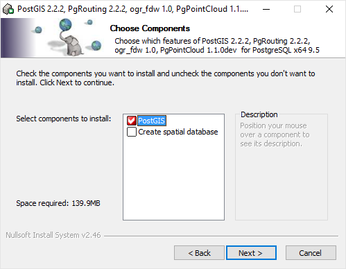
    
Hier wordt gevraagd waar de PostGIS uitbreiding geplaatst kan worden. We laten dit staan, mits dit klopt met de locatie van de PostgreSQL installatie.
  
.. image:: _static/images/nlextractimg(19).png
    :alt: alternate text

Op het volgende scherm wordt de gebruikersnaam en het wachtwoord gevraagd. Hiermee krijgt het installatieprogramma toegang tot PostgreSQL en kan een database worden aangemaakt (daar hadden we immers voor gekozen).  

.. image:: _static/images/nlextractimg(20).png
    :alt: alternate text

Nu wordt PostGIS geïnstalleerd. Dit verloopt redelijk vlot.
    
.. image:: _static/images/nlextractimg(22).png
    :alt: alternate text

Het is afhankelijk van de toepassing van de database, voor het gemak wordt de vraag bevestigd met 'Ja'.
    
.. image:: _static/images/nlextractimg(23).png
    :alt: alternate text

Het is afhankelijk van de toepassing van de database, voor het gemak wordt de vraag bevestigd met 'Ja'.
    
.. image:: _static/images/nlextractimg(24).png
    :alt: alternate text

Het is afhankelijk van de toepassing van de database, voor het gemak wordt de vraag bevestigd met 'Ja'.
    
.. image:: _static/images/nlextractimg(25).png
    :alt: alternate text

De installatie van PostGIS is geslaagd en de database is aangemaakt.    

.. image:: _static/images/nlextractimg(26).png
    :alt: alternate text

De Stack Builder geeft aan dat alle aangevinkte uitbreidingen zijn geïnstalleerd.
    
.. image:: _static/images/nlextractimg(27).png
    :alt: alternate text
    
|
|

.. _bag-create-login:

PgAdmin III - BAG login toevoegen
~~~~~~~~~~~~~~~~~~~~~~~~~~~~~~~~~

De tool pgAdmin III is geïnstalleerd tijdens de installatie van PostgreSQL. Zoek deze op in het menu (of druk op de Windows toets en type 'pgadmin') en start het programma. 

.. image:: _static/images/nlextractimg(28).png
    :alt: alternate text

Nadat pgAdmin III is geopend, maak een verbinding (Connect) met de PostgreSQL server.
    
.. image:: _static/images/nlextractimg(29).png
    :alt: alternate text

Voer het wachtwoord in dat behoort bij de gebruiker 'postgres'.

.. image:: _static/images/nlextractimg(30).png
    :alt: alternate text
    
Maak een nieuwe 'login' aan. Dit is een gebruiker van de database. Het is de bedoeling om een login te hebben die past bij de terug te zetten database dump, zoals in deze instructie staat beschreven. 
 
.. image:: _static/images/nlextractimg(31).png
    :alt: alternate text

De nieuwe login krijgt de naam 'basuser'. Natuurlijk kun je ook een andere naam kiezen.

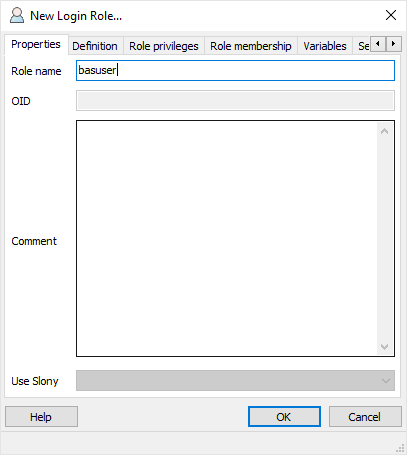
    
Kies een wachtwoord voor deze login, vul deze twee keer in en onthoud deze. Sluit af met 'OK'.
    
.. image:: _static/images/nlextractimg(34).png
    :alt: alternate text

De PostgreSQL database server heeft nu twee logins.
    
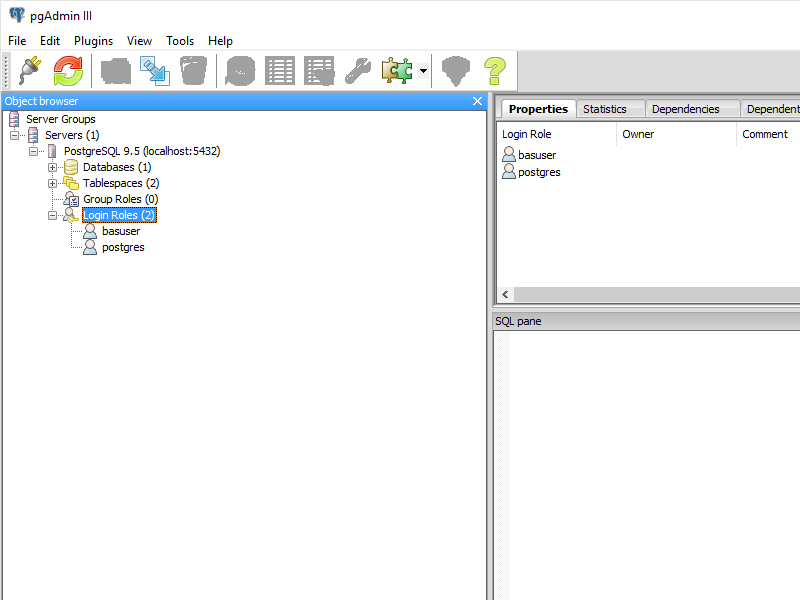

|
|

.. _bag-create-database:

PgAdmin III - BAG database aanmaken
~~~~~~~~~~~~~~~~~~~~~~~~~~~~~~~~~~~

De BAG database aanmaken omvat twee stappen, namelijk een PostgreSQL database aanmaken en een PostGIS uitbreiding toevoegen aan de database.
Open voor het aanmaken van een nieuwe database het contextmenu (rechter muisknop) op 'Databases' en kies 'New Database'.
NB belangrijk is dat de database met de character-set UTF-8 wordt aangemaakt!

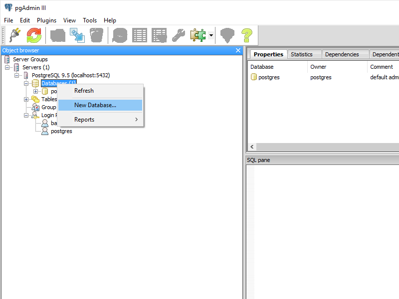

We noemen de database 'bagdb'. Kies de zojuist gemaakte inlog 'baguser' als eigenaar van de database.

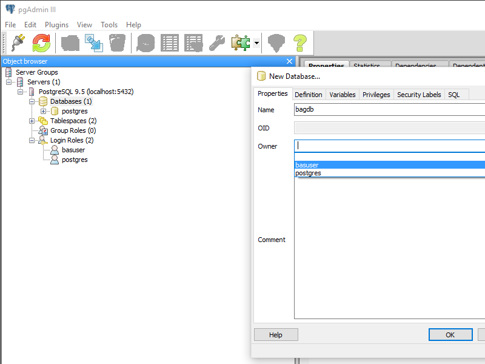

Er is nu een nieuwe database aangemaakt, echter bevat deze nog geen PostGIS mogelijkheden.
Hiervoor gaan we een uitbreiding toevoegen aan de database.
Kies 'New Extension' in het contextmenu  (rechter muisknop) op 'Extensions', binnen de database 'bagdb'.

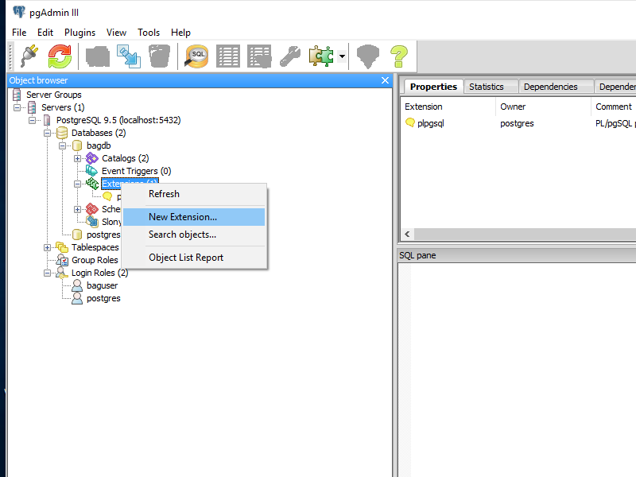

Kies in het scherm de uitbreiding 'postgis'.

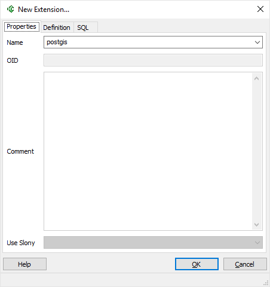

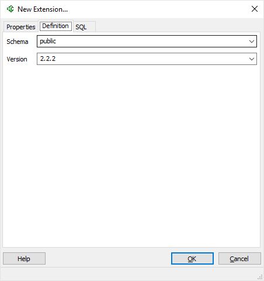

Klik op 'OK' en de uitbreiding 'postgis' zal zichtbaar worden.

|
|

.. _bag-dump-restore:

PgAdmin III - BAG dump terugzetten
~~~~~~~~~~~~~~~~~~~~~~~~~~~~~~~~~~

Kies optie 'Restore' middels het contextmenu (rechter muisknop) op de zojuiste gemaakte database 'bagdb'.  

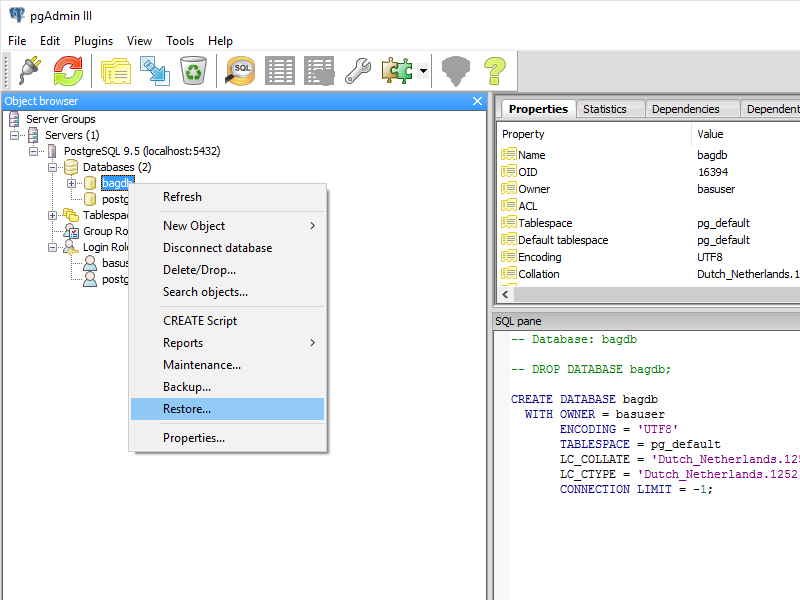

Kies als 'Filename' het eerder gedownloade bestand 'bag-laatst.backup' en kies als 'Rolename' de eerder aangemaakte login 'basuser'. 

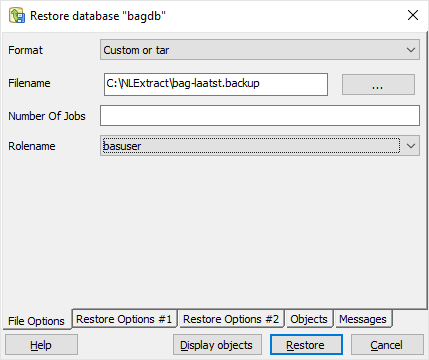

De restore opties:

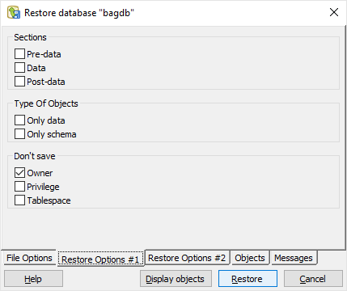

Kies 'Restore' en het terugzetten van de dump zal beginnen.

Nu is het herstelproces van de BAG database begonnen. Dit kan, afhankelijk van de capaciteit van de computer, enige tijd in beslag nemen (kwartier/half uur).
Aan het eind moet 'Proces returned exit code 0' zichtbaar zijn, dat aangeeft dat het terugzetten gelukt is.

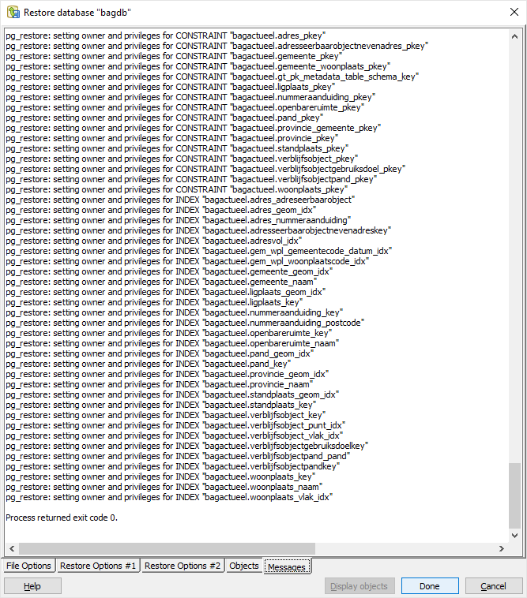

Kies eventueel een 'Refresh' om de navigatiestructuur te verversen, zodat alle herstelde data zichtbaar wordt.

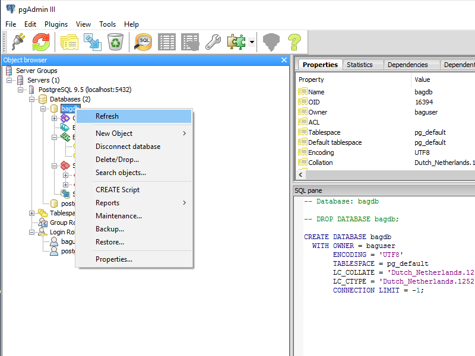

De database is klaar voor gebruik:

.. image:: _static/images/nlextractimg(49).png
    :alt: pgAdmin restore complete

De data bevindt zich in het schema 'bagactueel'. Houd hiermee rekening als je de BAG-data gebruikt in bijv. QGIS of een andere applicatie.

|
|

