.. _tooling:

********
Tooling
********

Om gebruik te maken van NLExtract data is ondersteunende software nodig, de tools om met de data te kunnen werken.
Hierbij is het uiteraard afhankelijk wat je wilt bereiken. In het algemeen kun je stellen dat de meeste gebruikers
gewoon de data willen gebruiken. Dan volstaat een database dump en uiteraard de database software.


Instructie (Windows)
====================

Deze beschrijving is een voorbeeldinstructie om de benodigde software te installeren en daarbij tevens een database dump terug te zetten. 
We beschrijven de volgende stappen:

* :ref:`Database Dump Downloaden <dump-downloaden>`
* :ref:`PostgreSQL Installeren <postgresql-install>`
* :ref:`PostGIS Installeren <postgis-install>`
* :ref:`PgAdmin III - BAG login toevoegen <bag-create-login>`
* :ref:`PgAdmin III - BAG eigenaar instellen <bag-owner>`
* :ref:`Instellen Path voor PostgreSQL tools <set-bin-path>`
* :ref:`BAG dump terugzetten <bag-dump-restore>`


.. _dump-downloaden:

Database Dump Downloaden
~~~~~~~~~~~~~~~~~~~~~~~~

Maak een nieuwe folder met bijvoorbeeld de naam 'NLExtract'. Dit is gewoon een locatie om de dumps die gedownload worden te bewaren.

.. image:: _static/images/nlextractimg(1).png
    :alt: lege map aanmaken

Ga naar de pagina (zoals beschreven in :ref:`NLExtract Download Service <nlextract-downloads>`) waar de gewenste database dump gekozen kan worden. In deze instructie kiezen we de BAG database. 
    
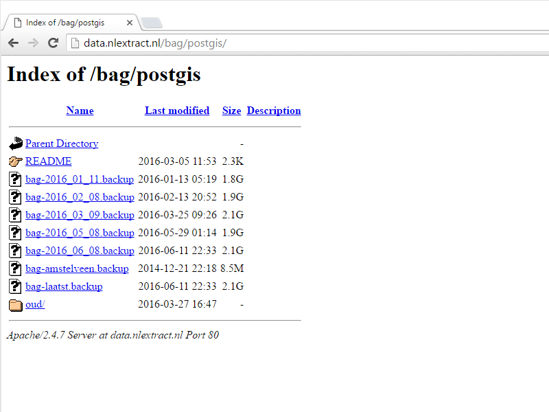

Kies 'link opslaan als' op 'bag-laatst.backup' via het contextmenu (rechter muisknop) en plaats het bestand in de zojuist gemaakte map 'NLExtract'.
Afhankelijk van de netwerkverbinding kan dit even duren, het bestand is groter dan 2 GB.

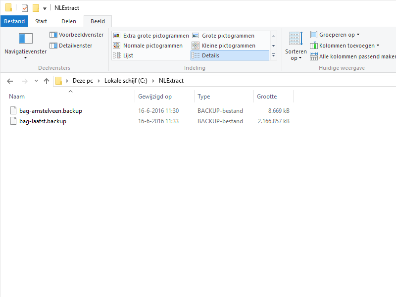

Eventueel bag-amstelveen.backup downloaden om te testen met een kleiner bestand. 

.. _postgresql-install:

PostgreSQL Installeren
~~~~~~~~~~~~~~~~~~~~~~

Ga naar de `PostgreSQL website <https://www.postgresql.org/download/windows/>`_ en klik door naar de `download <http://www.enterprisedb.com/products-services-training/pgdownload#windows>`_ pagina van EnterpriseDB.
We kiezen hier het installatieprogramma (32 of 64 bit - zie <Win>+<Break>) voor de meest recente en stabiele versie, in dit geval 9.5.3. 
    
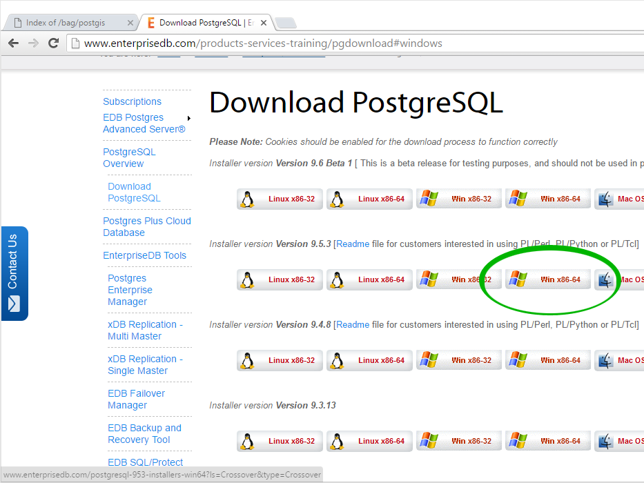

Het gedownloade bestand uitvoeren en de installatie begint.

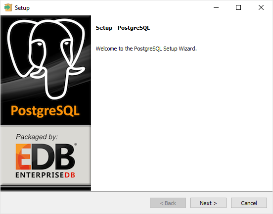

Er wordt gevraagd waar het programma geinstalleerd moet worden.
    
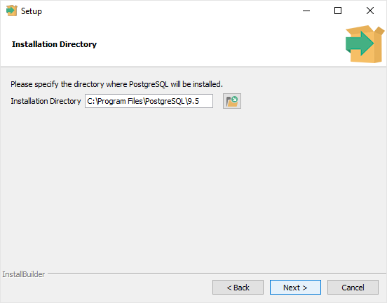

Daarna wordt gevraagd welke map gekozen kan worden voor data (databases). Er wordt voorgesteld om een data map in de 'Program Files' map
te gebruiken voor opslag van data. Dat is ongebruikelijk; beter is het om data van programmabestanden te scheiden. We kiezen
een eigen map.
    
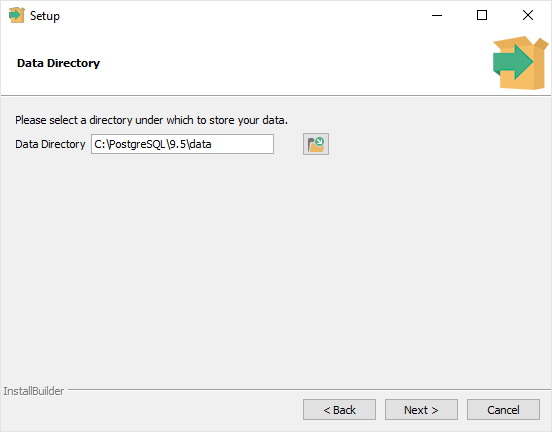
    
Kies een wachtwoord voor superuser 'postgres' en onthoud deze. Gebruikersnaam 'postgres' en het wachtwoord vormen de combinatie om op een later tijdstip toegang tot PostgreSQL te krijgen.

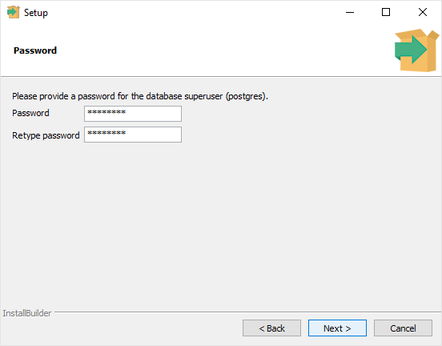

Behoud het standaard poortnummer.

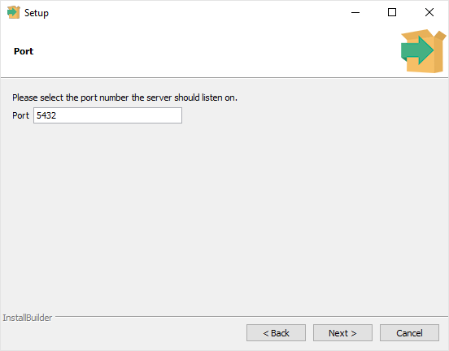
    
'Default locale' is prima.

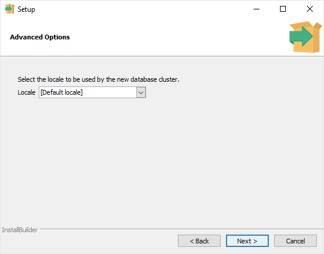

Alles is gereed om de installatie te beginnnen.
    
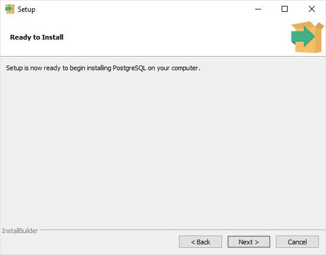

Als het goed is zal de installatie vlot verlopen. 
    
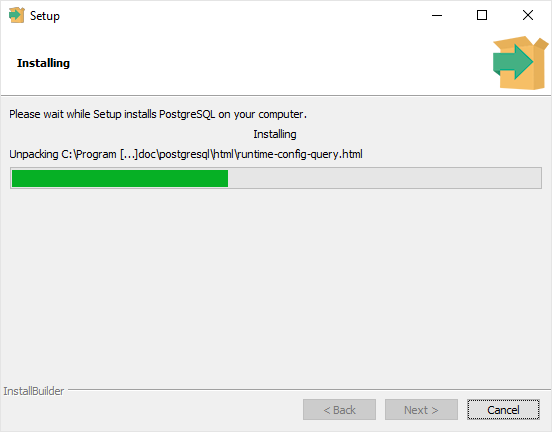
    
Nu is PostgreSQL geinstalleerd. Het laatste scherm biedt de mogelijkheid om uitbreidingen toe te voegen. We laten het vinkje aan staan zodat we PostGIS kunnen installeren, dat hierna wordt beschreven.

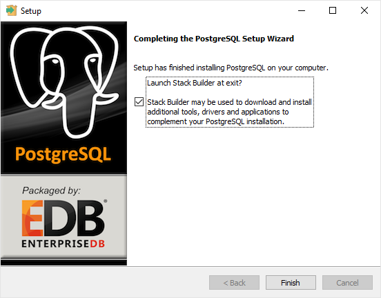

.. _postgis-install:

PostGIS Installeren
~~~~~~~~~~~~~~~~~~~~~~

PostGIS is de uitbreiding op PostgreSQL dat het mogelijk maakt om data met geometrische / geografische gegevens op te slaan en te verwerken.

We zien het beginscherm van de Application Stack Builder, dat in navolging op de PostgreSQL wordt uitgevoerd. Eventueel kan deze ook handmatig worden gestart. 

Kies in het keuzemenu de PostgreSQL server.

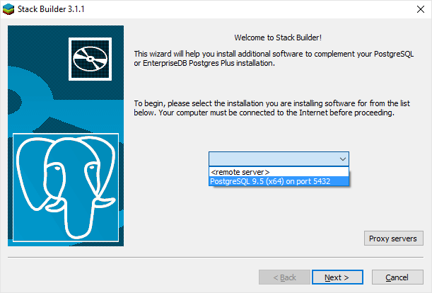

Kies in het volgende scherm de benodigde PostGIS bundle door een vinkje te plaatsen. Kies de bundle die bij de PostgreSQL installatie past. In deze instructie is dat 64 bit, PostgreSQL versie 9.5.     

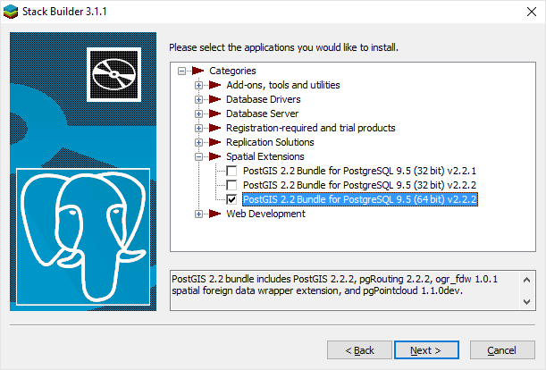

Stack builder vraagt waar de gedownloade uitbreidingen geplaatst mogen worden. In deze instructie kiezen we voor de standaard map met de naam 'downloads' (waar
alle downloads gebruikelijk toch al in komen). Een andere map zou ook prima moeten werken; het is bedoeld om tijdelijk te gebruiken.  

.. image:: _static/images/nlextractimg(16).png
    :alt: alternate text

Nu wordt gevraagd akkoord te gaan met de licentievoorwaarden.

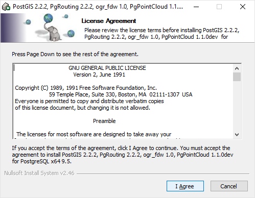
    
Voor het gemak vinken we de keuze 'create spatial database' aan. Het is in deze instructie de bedoeling om direct een database aan te maken die kan dienen om de dump (back-up) terug te zetten. Het kan uiteraard ook op een later moment.

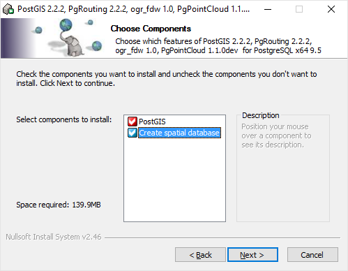
    
Hier wordt gevraagd waar de PostGIS uitbreiding geplaatst kan worden. We laten dit staan, mits dit klopt met de locatie van de PostgreSQL installatie.
  
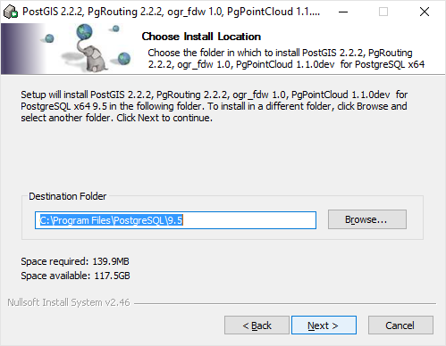

Op het volgende scherm wordt de gebruikersnaam en het wachtwoord gevraagd. Hiermee krijgt het installatieprogramma toegang tot PostgreSQL en kan een database worden aangemaakt (daar hadden we immers voor gekozen).  

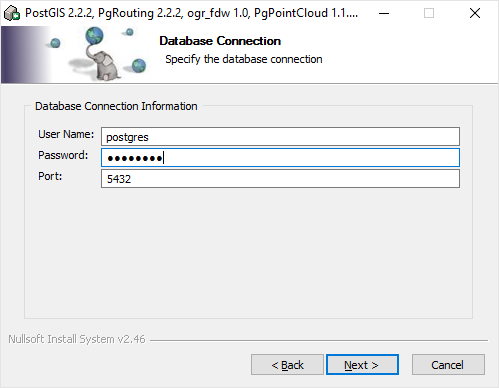
    
In deze instructie zetten we de BAG dump terug, dus we noemen de database 'bag'.

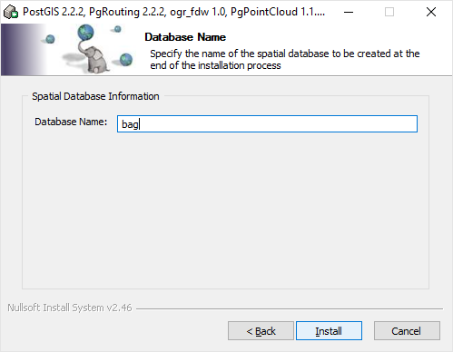

Nu wordt PostGIS geinstalleerd en wordt de database (met de naam 'bag') aangemaakt. Als het goed is, verloopt dit redelijk vlot.
    
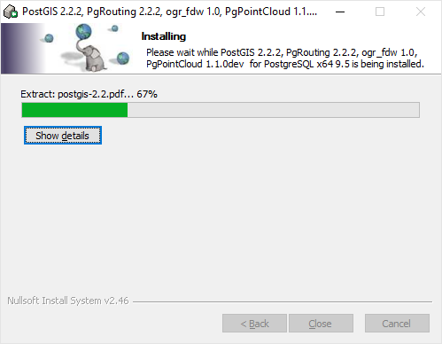

Het is afhankelijk van de toepassing van de database, voor het gemak wordt de vraag bevestigd met 'Ja'.
    
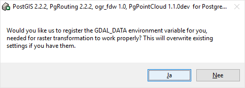

Het is afhankelijk van de toepassing van de database, voor het gemak wordt de vraag bevestigd met 'Ja'.
    
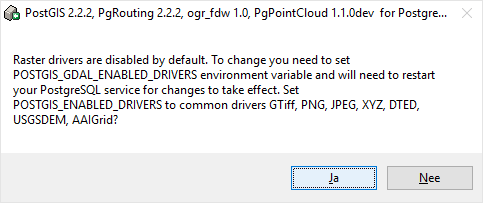

Het is afhankelijk van de toepassing van de database, voor het gemak wordt de vraag bevestigd met 'Ja'.
    
.. image:: _static/images/nlextractimg(25).png
    :alt: alternate text

De installatie van PostGIS is geslaagd en de database is aangemaakt.    

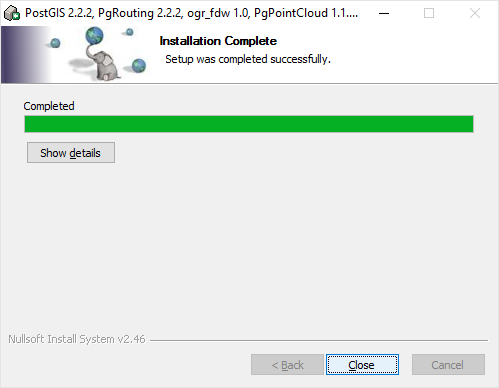

De Stack builder geeft aan dat alle aangevinkte uitbreidingen zijn geinstalleerd.
    
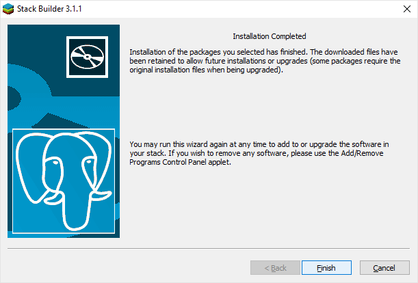
    
    
.. _bag-create-login:

PgAdmin III - BAG login toevoegen
~~~~~~~~~~~~~~~~~~~~~~~~~~~~~~~~~

De tool pgAdmin III is geinstalleerd tijdens de installatie van PostgreSQL. Zoek deze op in het menu (of druk op de Windows toets en type 'pgadmin') en start het programma. 

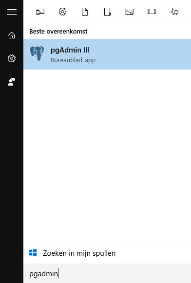

Nadat pgAdmin III is geopend, maak een verbinding (Connect) met de PostgreSQL server.
    
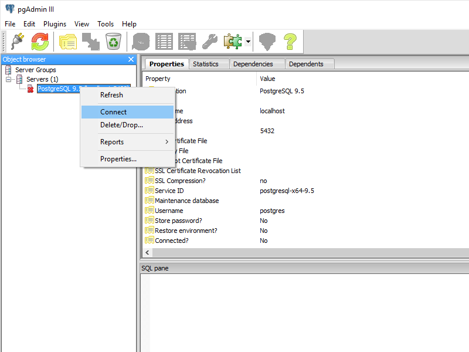

Voer het wachtwoord in dat behoort bij login 'postgres'.    

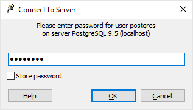
    
Maak een nieuwe 'login' aan. Het is de bedoeling om een login te hebben die past bij de terug te zetten database dump, zoals in deze instructie de bedoeling is. 
 
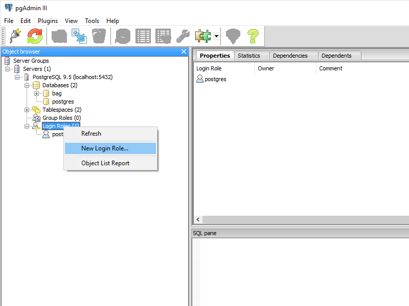

De nieuwe login krijgt de naam 'kademo'.

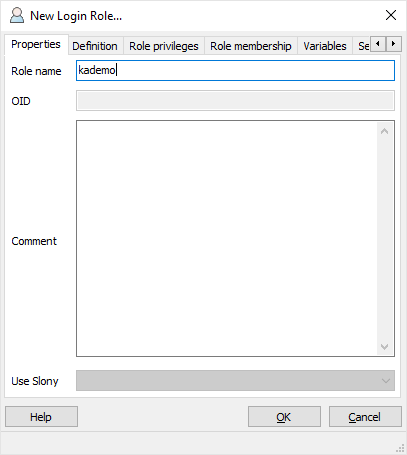
    
Kies een wachtoord voor deze login, vul deze twee keer in en onthoud deze. Sluit af met 'Ok'.
    
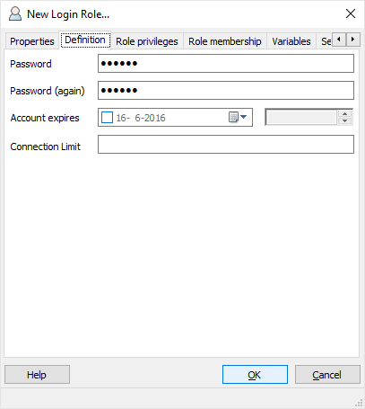

De PostgreSQL database server heeft nu twee logins.
    
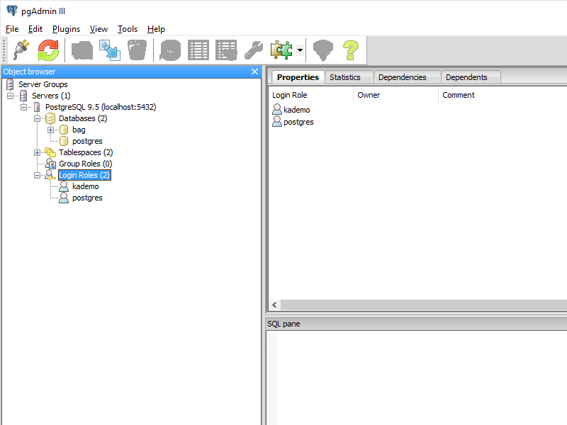

.. _bag-owner:

PgAdmin III - BAG eigenaar instellen
~~~~~~~~~~~~~~~~~~~~~~~~~~~~~~~~~~~~

Zoek binnen pgAdmin de 'bag' database, open het contextmenu en kies 'Properties'. 

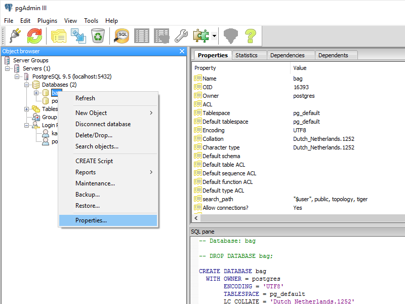
    
De eigenschappen van de database worden zichtbaar. Kies bij 'Owner' de eerder aangemaakte login met de naam 'kademo'. 
    
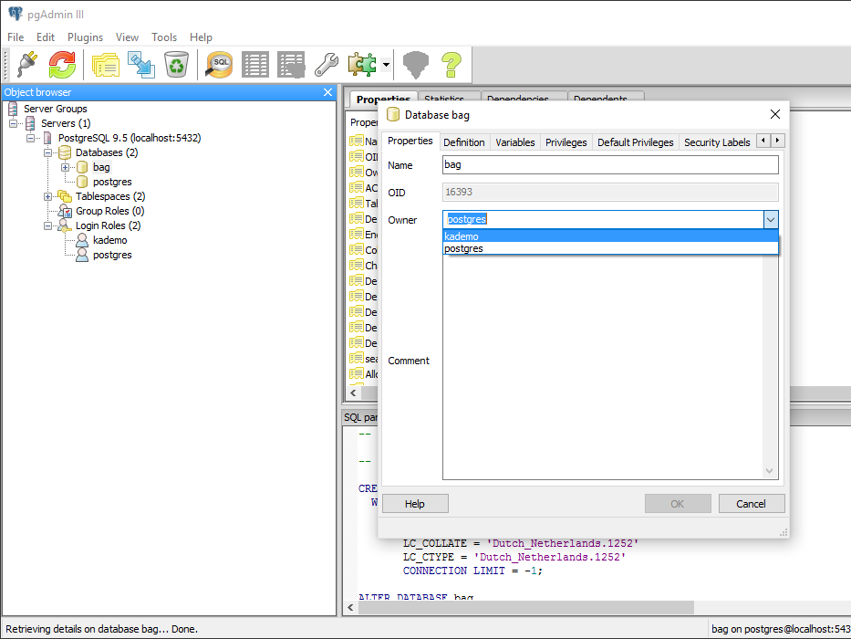
    
Login 'kademo' is nu eigenaar van de database 'bag'.
    
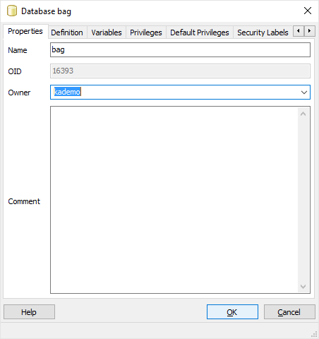

.. _set-bin-path:

Instellen Path voor PostgreSQL tools
~~~~~~~~~~~~~~~~~~~~~~~~~~~~~~~~~~~~

Indien gebruik gemaakt wordt van de console (Opdrachtprompt) om PostgreSQL utilities te gebruiken (in de volgende stap) dat is
het handig om de locatie van deze tools opgenomen te hebben in de PATH omgevingsvariable. Eigenlijk zou het installaieprogramma
van PostgreSQL dit moeten/kunnen verzorgen, maar dat is helaas niet gebeurd. Na aanpassen van de PATH variabele zijn de utilities aan te roepen vanuit willekeurige locatie.

Navigeer via de verkenner naar de 'Bin' map van de PostgreSQL installatie in 'Program Files'.    
    
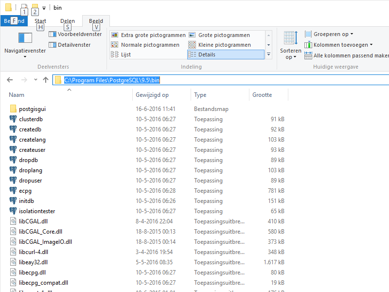
    
Daarna kan de maplocatie worden geselecteerd (wordt blauw) en naar het klembord worden gekopieerd. In het voorbeeld via de contextmenu, keuze 'Kopiëren'.  

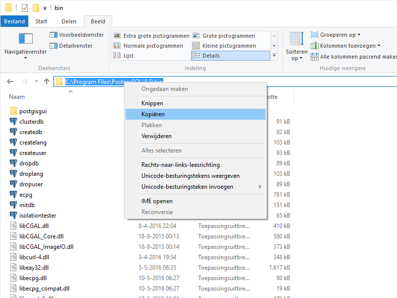

Open dan het 'Systeemeigenschappen' dialoog. Dat kan via het configuratiescherm -> Systeem en beveiliging -> Systeem. Een snelkopeling is <Win>+<Break>. Kies dan voor 'Geavanceerde systeeminstellingen'.

Kies de knop 'Omgevingsvariabelen'.    

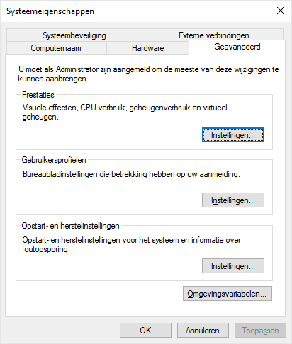

Onderstaand is het scherm zoals het er uitziet bij Windows 10. Kies variabele 'PATH' en klik op 'Bewerken'. Plak (Ctrl-V) dan op een nieuwe regel de locatie van de PostgreSQL Bin map.

Bij eerdere Windows versies kan de PATH variabele worden aangepast door de waarde te bewerken, een ';' scheidingsteken toe te voegen en dan de PostgreSQL Bin locatie er achteraan te plakken (of overtypen).

Sluit het venster door op 'Ok' te klikken.  
    
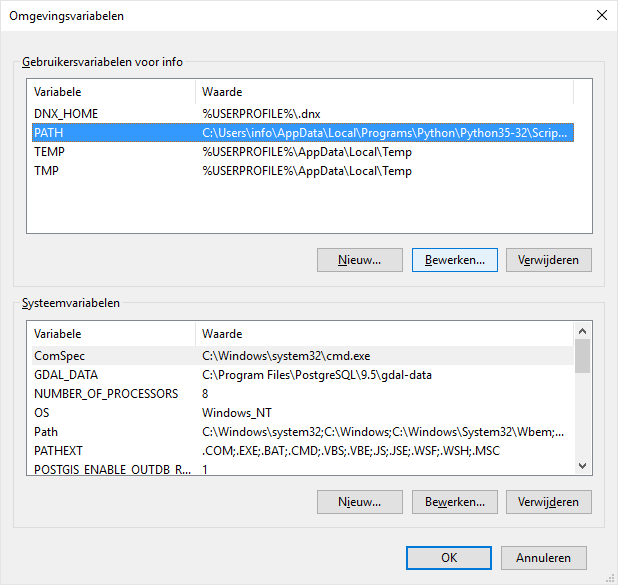
    
Elke opdrachtprompt die vanaf nu wordt geopend, zal door de PATH variabele de locatie van de PostgreSQL utilities kunnen vinden. Een reeds openstaande opdrachtprompt kent de nieuwe PATH variabele nog niet.  

.. _bag-dump-restore:

BAG dump terugzetten
~~~~~~~~~~~~~~~~~~~~

Open een Opdrachtprompt (<Win>+X, O) en ga naar de locatie waar de gedownloade database dumps zijn neergezet. In deze instructie is dat 'C:/NLExtract', dus type commando 'cd /NLExtract'. Voer commando 'dir' uit om de controleren of de dumps er staan.

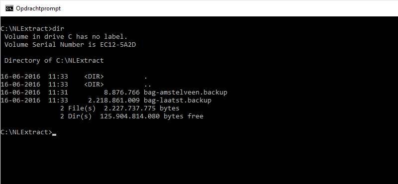

Nu gaan we de dump herstellen (restore) naar de database 'bag'.

```
pg_restore --no-owner --no-privileges --username=kademo -d bag bag-laatst.backup
```

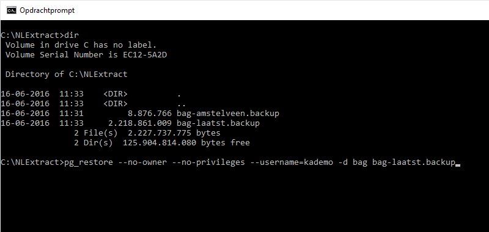
    
Er wordt om een wachtwoord gevraagd die bij de login van 'kademo' hoort. Zie :ref:`PgAdmin III - BAG login toevoegen <bag-create-login>`
    
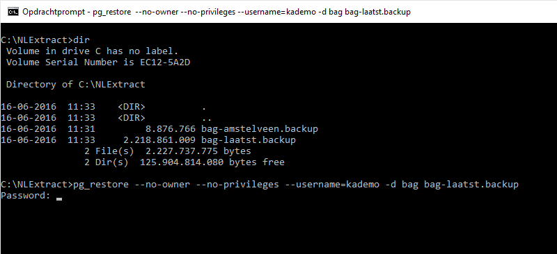

Nu is het herstelproces van de BAG database begonnen. Dit kan, afhankelijk van de capaciteit van de computer, enige tijd in beslag nemen (kwartier/half uur). Tijd voor koffie :) 

Om te bevestigen dat er echt iets gebeurt, kan via Taakbeheer (<Ctrl>+<Shift>+<Esc>) zichtbaar gemaakt worden dat PostgreSQL echt met de restore bezig is. Nog even geduld dus. 
 
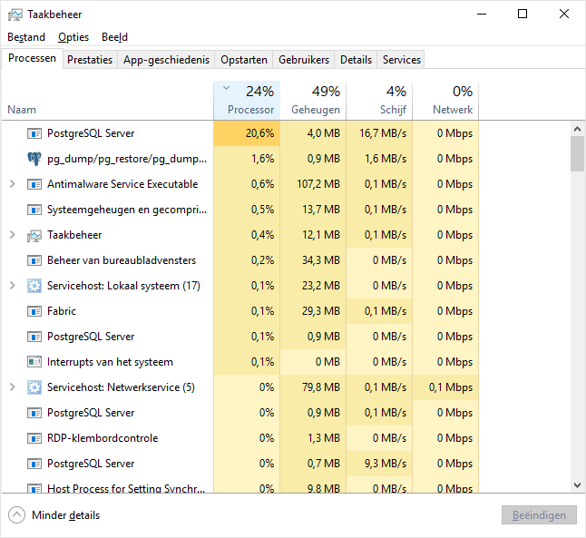

Als het proces is afgerond kan via pgAdmin de nieuwe inhoud van de BAG database worden gebruikt.

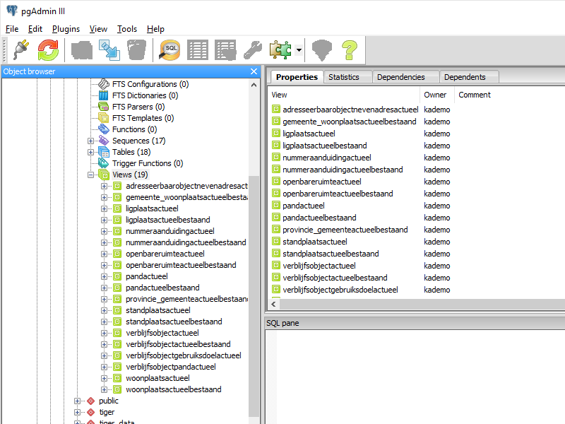


